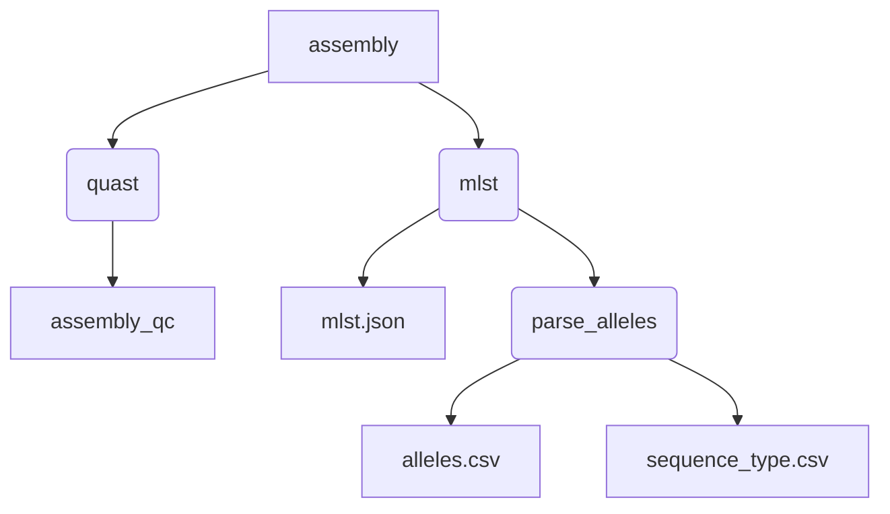

[](https://github.com/BCCDC-PHL/mlst-nf/actions/workflows/tests.yml)

# mlst-nf

A nextflow pipeline for running [mlst](https://github.com/tseemann/mlst) on a set of assemblies.



## Usage

```
nextflow run BCCDC-PHL/mlst-nf \
  --assembly_input </path/to/assemblies> \
  --outdir </path/to/outdir>
```

The pipeline also supports a 'samplesheet input' mode. Pass a samplesheet.csv file with the headers `ID`, `ASSEMBLY`:

```
nextflow run BCCDC-PHL/mlst-nf \
  --samplesheet_input </path/to/samplesheet.csv> \
  --outdir </path/to/outdir>
```

## Outputs

Outputs for each sample will be written to a separate directory under the output directory, named using the sample ID.

The following output files are produced for each sample.

```
sample-01
├── sample-01_20211202154752_provenance.yml
├── sample-01_alleles.csv
├── sample-01_mlst.json
└── sample-01_sequence_type.csv
```

If the `--versioned_outdir` flag is used, then a sub-directory will be created below each sample, named with the pipeline name and minor version:

```
sample-01
    └── mlst-nf-v0.1-output
        ├── sample-01_20211202154752_provenance.yml
        ├── sample-01_alleles.csv     
        ├── sample-01_mlst.json	      
        └── sample-01_sequence_type.csv
```

This is provided as a way of combining outputs of several different pipelines or re-analysis with future versions of this pipeline:

```
sample-01
    └── mlst-nf-v0.1-output
    │   ├── sample-01_20211202154752_provenance.yml
    │   ├── sample-01_alleles.csv
    │   ├── sample-01_mlst.json
    │   └── sample-01_sequence_type.csv
    └── mlst-nf-v0.2-output
        ├── sample-01_20220321113128_provenance.yml
        ├── sample-01_alleles.csv
        ├── sample-01_mlst.json
        └── sample-01_sequence_type.csv
```

The `mlst.json` output is generated directly by the [mlst](https://github.com/tseemann/mlst) tool.
It has the following format:

```json
[
   {
      "scheme" : "sepidermidis",
      "alleles" : {
         "mutS" : "1",
         "yqiL" : "1",
         "tpiA" : "1",
         "pyrR" : "2",
         "gtr" : "2",
         "aroE" : "1",
         "arcC" : "16"
      },
      "sequence_type" : "184",
      "filename" : "test/example.gbk.gz",
      "id" : "test/example.gbk.gz"
   }
]
```

The `alleles.csv` file is generated based on the `.json` output, and includes a couple of boolean (`True`/`False`) fields to indicate
whether the allele is a perfect match, or if it is a novel allele, based on the presence of `?` or `~` characters in the allele calls, as described
[here](https://github.com/tseemann/mlst#missing-data).

The per-locus `score` field is computed based on the rules described [here](https://github.com/tseemann/mlst#scoring-system).

The fields in in the `alleles.csv` output are:

```
sample_id
scheme
locus
allele
perfect_match
novel_allele
score
```

The `sequence_type.csv` file includes an overall sequence type ID based on the allele calls for each locus, and the overall
score, which is simply the sum of the per-locus scores for the sample.

```
sample_id
scheme
sequence_type
score
```

### Provenance
Each analysis will create a `provenance.yml` file for each sample. The filename of the `provenance.yml` file includes
a timestamp with format `YYYYMMDDHHMMSS` to ensure that a unique file will be produced if a sample is re-analyzed and outputs
are stored to the same directory.

```yml
- pipeline_name: BCCDC-PHL/mlst-nf
  pipeline_version: 0.1.4
  timestamp_analysis_start: 2024-02-20T22:59:37.862710
- input_filename: NC-000913.3.fa
  input_path: /home/runner/work/mlst-nf/mlst-nf/.github/data/assemblies/NC-000913.3.fa
  sha256: 6b195feda4c66140f6762742eb8b30c2652f02b45878b174f5b00ef85ecc95d7
- process_name: mlst
  tools:
    - tool_name: mlst
      tool_version: 2.16.1
      parameters:
      - parameter: minid
        value: 95
      - parameter: mincov
        value: 10
      - parameter: minscore
        value: 50
- process_name: quast
  tools:
    - tool_name: quast
      tool_version: 5.0.2
      parameters:
        - parameter: --space-efficient
          value: null
        - parameter: --fast
          value: null
        - parameter: --min-contig
          value: 0
```
